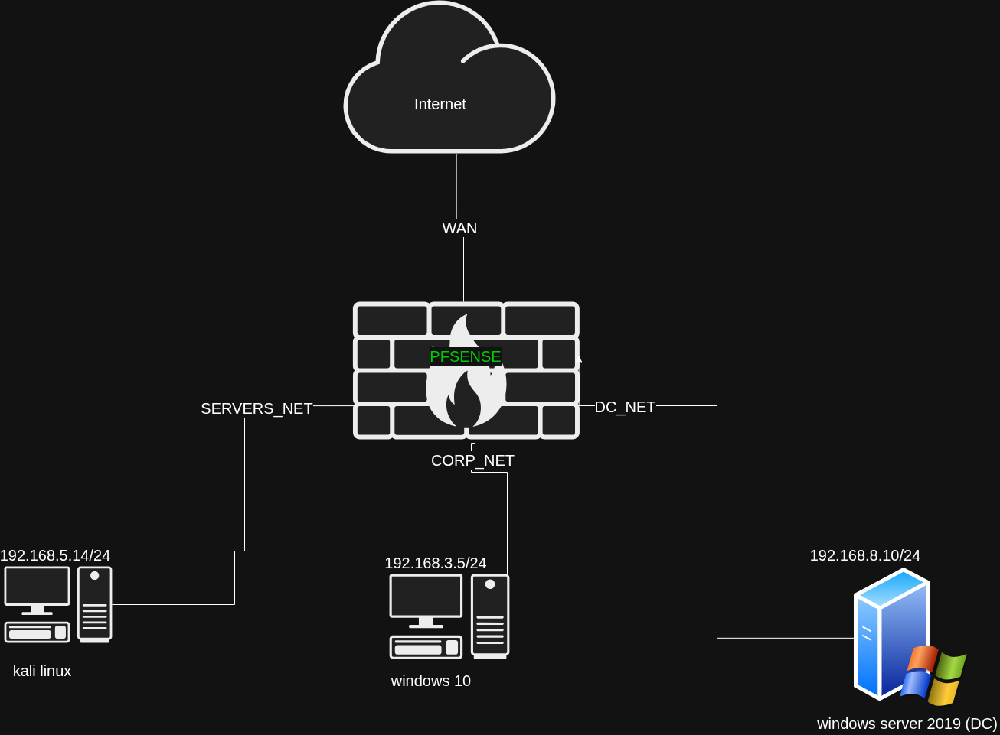

# Implementing Inter-VLAN Routing Using pfSense

## 🧠 Overview

In enterprise networks, systems are segmented into separate networks (VLANs) to improve security, performance, and organization. However, devices in different VLANs cannot communicate by default because they exist in separate broadcast domains.

This project demonstrates how pfSense can be configured as a Layer 3 device to enable inter-VLAN routing, allowing controlled communication between multiple isolated networks in a home lab environment.
---

## 🏗️ Lab Setup



### Network Segments:
- **CORP_NET**: 192.168.3.0/24 (Windows 10 Client)
- **SERVERS_NET**: 192.168.5.0/24 (Kali Linux)
- **DC_NET**: 192.168.8.0/24 (Windows Server 2019)

### Key Component:
- **pfSense Firewall** acting as the Layer 3 device for routing between networks

---

## 🧰 Tools Used

- **pfSense** – Firewall and router
- **Kali Linux** – Testing connectivity
- **Windows 10** – Client machine
- **Windows Server 2019** – Domain Controller
- **Virtualization Platform** (VirtualBox/VMware)

---

## ⚙️ Implementation

### 1. Interface Configuration in pfSense
- Assigned interfaces for each network:
  - WAN (Internet access)
  - CORP_NET
  - SERVERS_NET
  - DC_NET

- Configured IP addresses:
  - CORP_NET → 192.168.3.1/24
  - SERVERS_NET → 192.168.5.1/24
  - DC_NET → 192.168.8.1/24

---

### 2. Network Configuration on Hosts
Each host was configured with:

- IP address within its subnet
- Subnet mask: 255.255.255.0
- Default gateway set to pfSense interface IP

Example:
- Windows 10 → Gateway: 192.168.3.1
- Kali Linux → Gateway: 192.168.5.1

---

### 3. Routing Behavior
By default, pfSense allows traffic between interfaces unless restricted by firewall rules.

No additional static routes were required because pfSense automatically routes between directly connected networks.

---

## 🧪 Testing Connectivity

### From Windows 10 (CORP_NET):
```bash
ping 192.168.8.10
